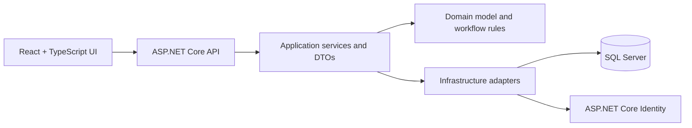

# MortgageFlow

MortgageFlow is a role-based mortgage workflow and assignment simulation built as a production-style full-stack application.

It demonstrates how a broker-facing loan intake flow can move through secure backend workflow rules, SQL-backed persistence, deterministic assignment, and a React review interface. All data is synthetic. This project does not claim to reproduce any company's internal systems, proprietary workflows, or business rules.

## What it demonstrates

- Domain-driven C# modeling with guarded workflow transitions.
- ASP.NET Core REST APIs with versioned routes, Problem Details, cancellation-aware actions, and JWT role policies.
- SQL Server persistence through EF Core, migrations, indexes, history records, audit records, and row-version concurrency.
- ASP.NET Core Identity for user and role management; the project does not implement password hashing itself.
- A deterministic assignment engine using eligibility, weighted workload, capacity, priority, and round-robin tie-breaking.
- A React + TypeScript frontend with in-memory JWT auth, role-aware navigation, loan intake/detail screens, queue views, and Team Lead assignment controls.
- SQL-backed integration tests, frontend tests, GitHub Actions quality gates, Docker Compose startup, and operational documentation.

## Demo workflow

The intended demo path is:

1. Broker signs in, creates a synthetic loan, edits draft details, and submits it.
2. Team Lead reviews the submitted loan, triggers assignment, adjusts priority, and can reassign with a reason.
3. Processor works assigned queue items and advances eligible loans through processing.
4. Underwriter reviews assigned underwriting work and approves or rejects.
5. The API persists status history, assignment records, audit entries, and row-version updates.

The backend remains the source of truth for authorization and validation. Frontend role checks improve usability, but hidden UI buttons are not treated as security.

## Screenshots

Final screenshots live in [docs/screenshots](docs/screenshots/README.md).

They show the login flow, role-aware navigation, loan details/history, Team Lead assignment, personal queue review, OpenAPI contract, and passing CI evidence. Screenshots use synthetic data only.

## Architecture

MortgageFlow is intentionally a modular monolith:



See [docs/architecture](docs/architecture/README.md) for the workflow, ER overview, assignment sequence, authorization model, and tradeoffs.

## Stack

- C# / .NET 10 / ASP.NET Core
- React 19 + TypeScript + Vite
- SQL Server + EF Core
- ASP.NET Core Identity + JWT bearer authentication
- xUnit integration tests
- Vitest + Testing Library frontend tests
- Docker Compose
- GitHub Actions

## Local configuration

Create a private `.env` file from placeholders:

```bash
cp .env.example .env
```

Edit `.env` with strong local-only values. Do not commit `.env`, tokens, passwords, or expanded Docker config output.

Required local settings:

- `MORTGAGEFLOW_SQL_PASSWORD`
- `ConnectionStrings__DefaultConnection`
- `Jwt__Issuer`
- `Jwt__Audience`
- `Jwt__SigningKey`
- `Jwt__ExpiryMinutes`
- `Seed__DemoPassword`
- `Database__ApplyMigrationsOnStartup`

## Full Docker startup

From the repository root:

```bash
docker compose config --quiet
docker compose up -d --build
docker compose ps
```

Open the frontend:

```text
http://localhost:5173
```

Useful health endpoints:

- `GET http://localhost:5123/health/live`
- `GET http://localhost:5123/health/ready`

If synthetic seed data changes and your local SQL volume still shows older demo rows, reset local Docker data:

```bash
docker compose down -v
docker compose up -d --build
```

The `-v` flag deletes only the local Docker SQL volume. It does not delete source code, commits, migrations, or GitHub data.

## Demo accounts

The app seeds synthetic users when `Seed__DemoPassword` is configured. The password is intentionally not committed; use the value from your private `.env`.

| Role | Email |
| --- | --- |
| Broker | `broker@example.test` |
| Processor | `processor@example.test` |
| Processor | `processor.secondary@example.test` |
| Underwriter | `underwriter@example.test` |
| Underwriter | `underwriter.secondary@example.test` |
| Team Lead | `teamlead@example.test` |

## API surface

- `POST /api/v1/auth/login`
- `GET /api/v1/auth/me`
- `POST /api/v1/loans`
- `GET /api/v1/loans?page=&pageSize=&search=&status=`
- `GET /api/v1/loans/{id}`
- `PUT /api/v1/loans/{id}`
- `POST /api/v1/loans/{id}/transitions`
- `GET /api/v1/loans/{id}/history`
- `POST /api/v1/loans/{id}/assign`
- `POST /api/v1/loans/{id}/reassign`
- `PATCH /api/v1/loans/{id}/priority`
- `GET /api/v1/queues/me`
- `GET /api/v1/queues/team`
- `GET /openapi/v1.json` in Development

## Verification

Backend:

```bash
dotnet restore
dotnet format --verify-no-changes --no-restore
dotnet build --configuration Release --no-restore --disable-build-servers
set -a
source .env
set +a
dotnet test --configuration Release --no-build --disable-build-servers --collect:"XPlat Code Coverage"
```

Frontend:

```bash
cd src/mortgageflow-web
npm ci
npm run lint
npm run typecheck
npm run test:run
npm run build
npm audit --audit-level=moderate
npm audit signatures
```

Docker smoke:

```bash
docker compose config --quiet
docker compose up -d --build
docker compose ps
curl http://localhost:5123/health/live
curl http://localhost:5123/health/ready
```

GitHub Actions runs backend build/tests with SQL Server, frontend lint/typecheck/tests/build/audit/signature checks, backend coverage artifact upload, and Docker image build validation.

## Security and data boundaries

- No real borrower data is required or included.
- Demo users and loans use synthetic `example.test` identities.
- Passwords, JWT signing keys, SQL passwords, connection strings, and local `.env` values stay outside Git.
- Audit summaries avoid borrower names, emails, income, and property details.
- Request logs include safe correlation metadata, not tokens or sensitive loan details.
- Role visibility is enforced in application queries and services. SQL Server row-level security is a documented future hardening option, not part of this MVP.

## Tradeoffs

- Modular monolith over microservices: simpler local execution, easier transaction boundaries, and stronger focus on business workflow.
- SQL Server required instead of SQLite substitution: heavier locally, but better proof for EF Core mappings, migrations, concurrency, and relational constraints.
- In-memory frontend token storage: safer than persistent browser storage for this demo, with the tradeoff that refresh requires signing in again.
- No document upload, external credit integrations, Kafka, Redis, cloud deployment, or advanced dashboarding: those are intentionally deferred to keep the MVP complete and explainable.

## Future work

- Database-level row security policies for defense in depth.
- A richer admin view for managing employee availability and skills.
- Document upload and review tasks.
- Deployment pipeline with environment-specific secrets.
- Observability dashboards built from the existing correlation and audit model.

## Additional docs

- [Architecture notes](docs/architecture/README.md)
- [Operations notes](docs/operations/README.md)
- [Product walkthrough](docs/demo/README.md)
- [Screenshots](docs/screenshots/README.md)
- [ADRs](docs/adr)
