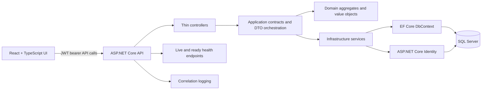
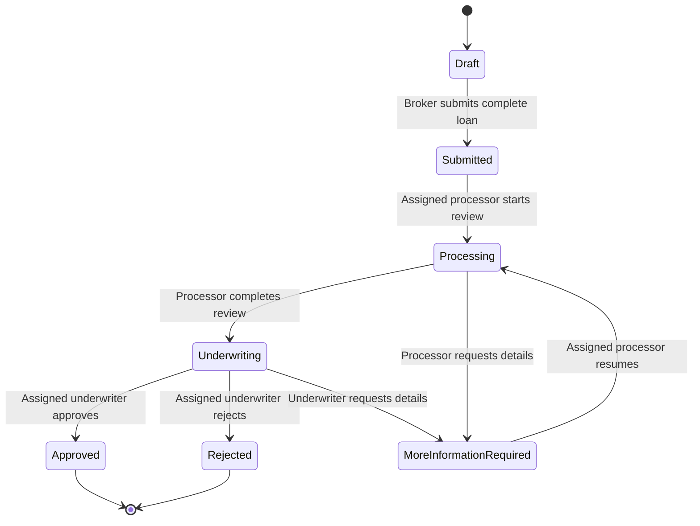
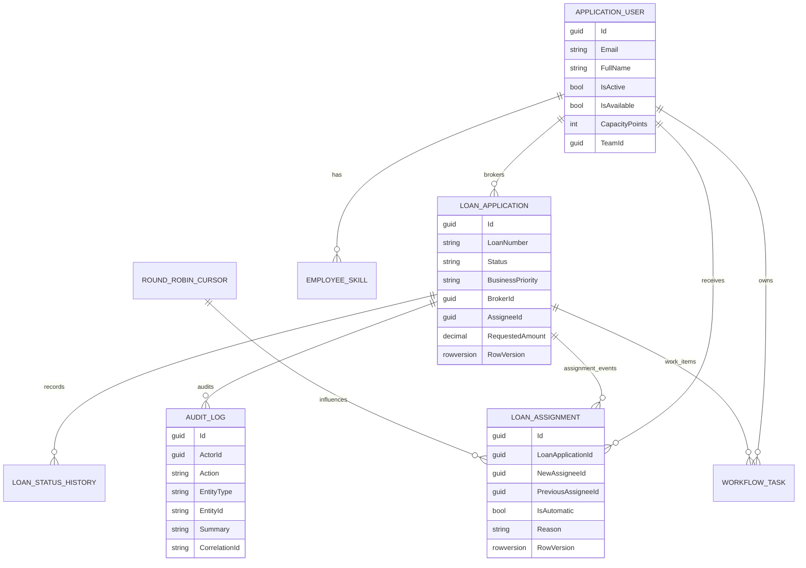
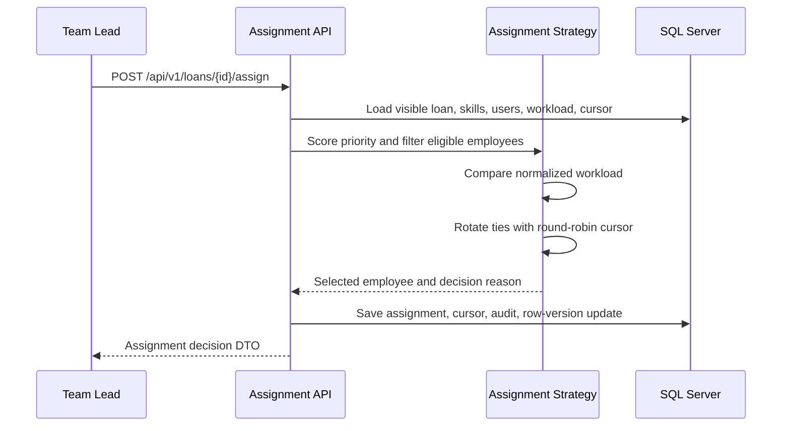

# Architecture Notes

MortgageFlow is a modular monolith. The goal is to show production-style boundaries without adding distributed-system complexity before the core workflow is proven.

## System architecture



The Domain project owns workflow rules and invariants. Infrastructure adapts those rules to EF Core, SQL Server, Identity, assignment persistence, and audit logging. The API exposes DTOs instead of EF entities.

## Loan workflow



Successful transitions update the loan, status history, audit log, and row version transactionally. Invalid transitions do not write history or audit rows.

## Role visibility and actions

| Role | Visibility | Allowed workflow actions |
| --- | --- | --- |
| Broker | Own loans only | Create draft, update own draft, submit own complete draft |
| Processor | Assigned processing-stage loans | Move assigned submitted loans into processing; move assigned processing loans to underwriting or more-information-required |
| Underwriter | Assigned underwriting-stage loans | Approve, reject, or request more information on assigned underwriting loans |
| Team Lead | Broad workflow visibility | Trigger automatic assignment, manually reassign with reason, and update business priority |

Cross-owner or cross-visibility reads return `404` so private loan existence is not disclosed. Authenticated users who can see a loan but do not have the right role/action receive `403`.

## Data model overview



Owned borrower/property fields live on the loan aggregate table through EF Core owned types. Audit summaries intentionally avoid borrower and property details.

## Assignment engine

Priority and assignment are separate decisions:

```text
Priority answers: which loan should be handled first?
Assignment answers: which eligible employee should receive it?
```



Priority score is deterministic and clamped from `0` to `100`:

```text
Due date bucket: overdue +50, within 1 day +30, within 3 days +20, within 7 days +10
Business priority: High +15, Urgent +30
Returned from more-information-required: +10
Age over ten business days: +10
```

Only one due-date bucket applies. Queue sorting uses score descending, oldest submitted date, then loan number.

Eligibility is stage-based:

| Loan stage | Required role | Required skill |
| --- | --- | --- |
| Submitted, Processing, MoreInformationRequired | Processor | `processing` |
| Underwriting | Underwriter | `underwriting` |

Candidates must be active, available, in the same team, have the required skill, and have remaining weighted capacity.

Normalized load compares employees with different capacities:

```text
OpenTaskWeight = Normal(2) + High(3) + Urgent(5)
WeightedLoad = OpenTaskWeight + (2 * ActiveLoanCount)
NormalizedLoad = WeightedLoad / CapacityPoints
```

When equal candidates tie on normalized load, a persisted round-robin cursor rotates the selected employee by routing key. Assignment, cursor updates, assignment records, and audit rows are saved transactionally.

## Persistence and security notes

- Loan changes use SQL Server row-version concurrency checks. Stale edits or transitions return `409 Conflict`.
- Status history and audit rows are saved in the same transaction as successful workflow changes.
- Failed transitions and failed assignments do not write misleading audit/history rows.
- Request correlation IDs are accepted from `X-Correlation-ID` only when short and safe; otherwise the server trace ID is used.
- SQL Server row-level security is not enabled in this MVP. Role visibility is enforced in application queries and services, with database-level policy as future hardening.
