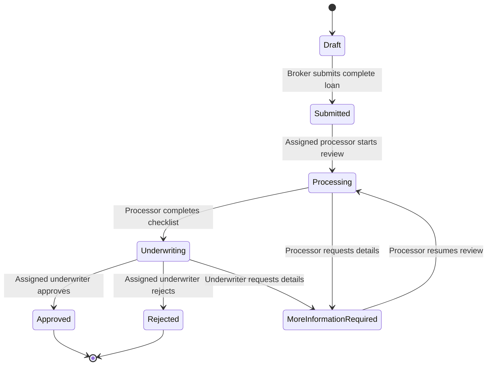

# Architecture Notes

MortgageFlow starts as a modular monolith:

```text
React/Vite UI -> ASP.NET Core API -> Application Services -> Domain
                                      Infrastructure -> SQL Server
```

The Domain project owns core workflow rules and invariants. Infrastructure adapts those rules to EF Core, SQL Server, Identity, and other external concerns.

## Loan workflow slice

The backend workflow slice keeps controllers thin and places business rules behind application contracts:

```text
LoansController -> ILoanWorkflowService -> MortgageFlowDbContext -> SQL Server
                                   \-> LoanApplication aggregate
```

The API returns DTOs instead of EF entities. That keeps persistence details, row-version tracking, and authorization checks inside the backend boundary.



## Role visibility and actions

| Role | Visibility | Allowed workflow actions |
| --- | --- | --- |
| Broker | Own loans only | Create draft, update own draft, submit own complete draft |
| Processor | Assigned processing-stage loans | Move assigned submitted loans into processing, move assigned processing loans to underwriting or more-information-required |
| Underwriter | Assigned underwriting-stage loans | Approve, reject, or request more information on assigned underwriting loans |
| Team Lead | Broad workflow visibility | Read workflow state for oversight; assignment and queue controls are deferred |

Cross-owner or cross-visibility reads return `404` so private loan existence is not disclosed. Authenticated users who can see a loan but do not have the right role/action receive `403`.

## Persistence and security notes

- Loan changes use SQL Server row-version concurrency checks. Stale edits or transitions return `409 Conflict`.
- Status history and audit rows are saved in the same transaction as a successful status transition.
- Failed transitions do not write status history or audit rows.
- Audit summaries intentionally avoid borrower and property details.
- SQL Server row-level security is not enabled in this slice; role visibility is enforced in application queries and services, with database-level policy as future hardening.
