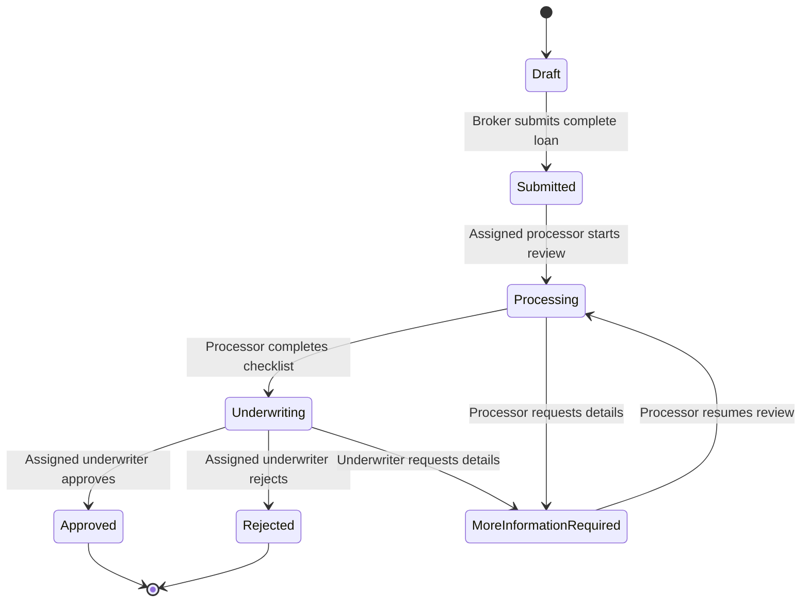

# Architecture Notes

MortgageFlow starts as a modular monolith:

```text
React/Vite UI -> ASP.NET Core API -> Application Services -> Domain
                                      Infrastructure -> SQL Server
```

The Domain project owns core workflow rules and invariants. Infrastructure adapts those rules to EF Core, SQL Server, Identity, and other external concerns.

## Loan workflow slice

The backend workflow slice keeps controllers thin and places business rules behind application contracts:

```text
LoansController -> ILoanWorkflowService -> MortgageFlowDbContext -> SQL Server
                                   \-> LoanApplication aggregate
```

The API returns DTOs instead of EF entities. That keeps persistence details, row-version tracking, and authorization checks inside the backend boundary.



## Role visibility and actions

| Role | Visibility | Allowed workflow actions |
| --- | --- | --- |
| Broker | Own loans only | Create draft, update own draft, submit own complete draft |
| Processor | Assigned processing-stage loans | Move assigned submitted loans into processing, move assigned processing loans to underwriting or more-information-required |
| Underwriter | Assigned underwriting-stage loans | Approve, reject, or request more information on assigned underwriting loans |
| Team Lead | Broad workflow visibility | Trigger automatic assignment, manually reassign with reason, and update business priority |

Cross-owner or cross-visibility reads return `404` so private loan existence is not disclosed. Authenticated users who can see a loan but do not have the right role/action receive `403`.

## Persistence and security notes

- Loan changes use SQL Server row-version concurrency checks. Stale edits or transitions return `409 Conflict`.
- Status history and audit rows are saved in the same transaction as a successful status transition.
- Failed transitions do not write status history or audit rows.
- Audit summaries intentionally avoid borrower and property details.
- SQL Server row-level security is not enabled in this slice; role visibility is enforced in application queries and services, with database-level policy as future hardening.

## Assignment engine

Priority and assignment are separate decisions:

```text
Priority answers: which loan should be handled first?
Assignment answers: which eligible employee should receive it?
```

The assignment engine composes small policies:

```text
Loan priority -> Eligibility filter -> Normalized workload -> Round-robin tie-breaker
```

Priority score is deterministic and clamped from `0` to `100`:

```text
Due date bucket: overdue +50, within 1 day +30, within 3 days +20, within 7 days +10
Business priority: High +15, Urgent +30
Returned from more-information-required: +10
Age over ten business days: +10
```

Only one due-date bucket applies. Queue sorting uses score descending, oldest submitted date, then loan number.

Eligibility is stage-based:

| Loan stage | Required role | Required skill |
| --- | --- | --- |
| Submitted, Processing, MoreInformationRequired | Processor | `processing` |
| Underwriting | Underwriter | `underwriting` |

Candidates must be active, available, in the same team, have the required skill, and have remaining weighted capacity.

Normalized load compares employees with different capacities:

```text
OpenTaskWeight = Normal(2) + High(3) + Urgent(5)
WeightedLoad = OpenTaskWeight + (2 * ActiveLoanCount)
NormalizedLoad = WeightedLoad / CapacityPoints
```

Worked example:

```text
Processor A: OpenTaskWeight 5 + (2 * 1 active loan) = 7; capacity 8; normalized load 0.875
Processor B: OpenTaskWeight 2 + (2 * 0 active loans) = 2; capacity 12; normalized load 0.1667

Processor B wins because the normalized load is lower, even before considering round-robin ties.
```

When equal candidates tie on normalized load, a persisted round-robin cursor rotates the selected employee by routing key. Assignment, cursor updates, assignment records, and audit rows are saved transactionally.
